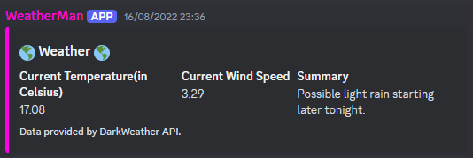
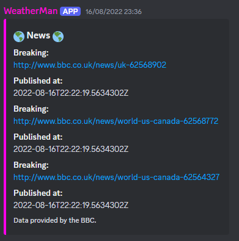

# WeatherMan

Discord bot that pulls current weather information and live news stories. 

This project is split into two modules, client and exception, the client module is used only for making requests 
outwards towards API's that the bot uses to populate its messages. Exception module is self-explanatory. 

### Message from the bot when asked about the weather 

### Message from the bot when asked about the news 

